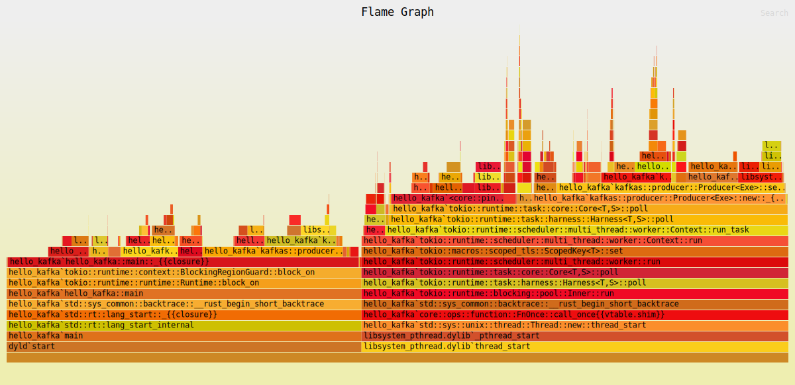

# kafkas

Async kafka client in pure Rust.

## Features

- Multiple async runtime (`tokio`, `async-std`, etc.)
- All versions of kafka are supported
- Compression (`gzip`, `snappy`, `lz4`)

## APIs

- [x] Producer
- [x] Consumer
- [ ] Streams
- [ ] Connect
- [ ] Admin client

## Usage

```toml
[dependencies]
kafkas = { git = "https://github.com/iamazy/kafkas", branch = "main" }
```

To get started using kafkas:

- Producer

```rust
#[tokio::main]
async fn main() -> Result<(), Box<Error>> {
    let client = Kafka::new("127.0.0.1:9092", KafkaOptions::default(), TokioExecutor).await?;

    let producer = Producer::new(client, ProducerOptions::default()).await?;

    let (mut tx, mut rx) = futures::channel::mpsc::unbounded();
    tokio::task::spawn(Box::pin(async move {
        while let Some(fut) = rx.next().await {
            if let Err(e) = fut.await {
                error!("{e}");
            }
        }
    }));

    let topic = topic_name("kafka");
    for _ in 0..10000_0000 {
        let record = TestData::new("hello kafka");
        let ret = producer.send(&topic, record).await?;
        let _ = tx.send(ret).await;
    }
}
```

- Consumer

```rust
#[tokio::main]
async fn main() -> Result<(), Box<Error>> {
    let client = Kafka::new("127.0.0.1:9092", KafkaOptions::default(), TokioExecutor).await?;

    let mut consumer_options = ConsumerOptions::new("default");
    consumer_options.auto_commit_enabled = false;
    
    let mut consumer = Consumer::new(kafka_client, consumer_options).await?;
    let consume_stream = consumer.subscribe(vec!["kafka"]).await?;
    pin_mut!(consume_stream);

    while let Some(records) = consume_stream.next().await {
        for record in records {
            // do something
        }
        // needed only when `auto_commit_enabled` is false
        consumer.commit_async().await?;
    }
}
```

## Examples

Examples can be found in [`examples`](https://github.com/iamazy/kafkas/blob/main/examples).

## Flame graph



## Rust version requirements

The rust version used for `kafkas` development is `1.65`.

## Acknowledgments

- [kafka-protocol-rs](https://github.com/tychedelia/kafka-protocol-rs) : Rust implementation of the [Kafka wire protocol](https://kafka.apache.org/protocol.html).
- [pulsar-rs](https://github.com/streamnative/pulsar-rs) : Rust Client library for Apache Pulsar
- [rskafka](https://github.com/influxdata/rskafka) : A minimal Rust client for Apache Kafka